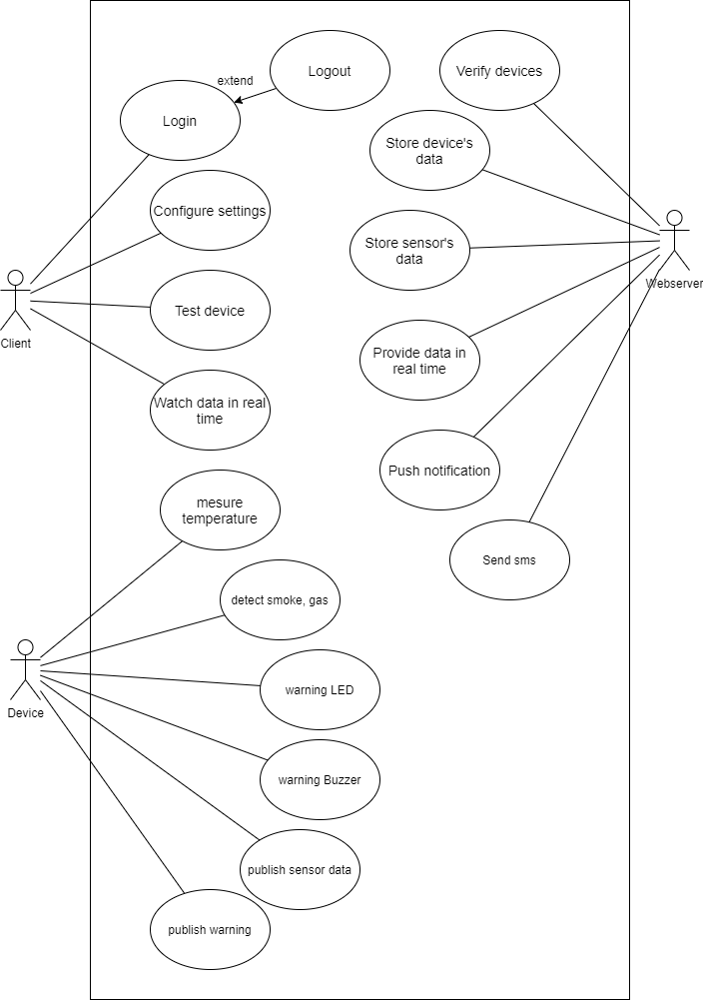
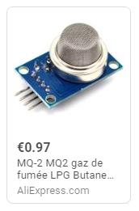
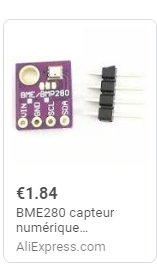
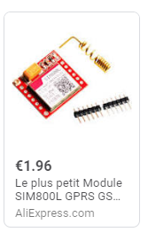
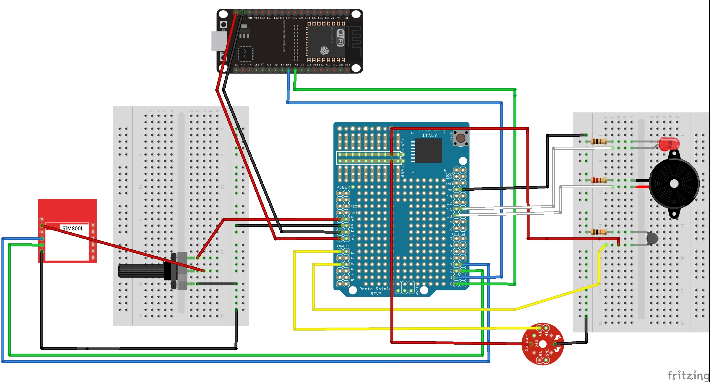

# IoT Project 2020 - Legendary Enigma

## 1. Description de projet
Notre projet est de développer une cloche d'alarme incendie. L'alarme incendie a un LED, un Buzzer et les deux méthodes: pousser la
notification mobile et envoyer le SMS pour annoncer.

Nous utilison les services de AWS comme : AWS EC2, AWS IoT Core, AWS SNS, AWS DynamoDb

## 2. Function
- Détecter le gaz et la fumée

- Mesurer la température, l'humidité, la pression

- Quand le gaz est détecté ou la fumée est détectée:
	+ Envoyer un avertissement au client par la notification mobile.
	+ Si Wifi n'est pas disponible, device envoiera un SMS au client.
	
- Le client peut voir les données (température, humidité, pression) sur l'application mobile en temps réel et dans un moi, dans une semaine.

- Le client peut configurer des paramètre de device (wifi & password, temps de collecter, connection de bluetooth, ...)

- un Server simple est de stocker les données, d'envoyer les informations au client et de calculer les statistiques.

- Frontend est l'application mobile qui inclut
	+ configurer les parametres - Wifi, numero de telephone
	+ test la fonctionalite d'anoncer
	+ regarder les données en temps réel

Usecase Diagram:

## 3.Description des fonctionalités:

## 4. Component
- Arduino UNO R3 	: Micro Controller

- MQ2 sensor 		: Gaz & Smoke sensor

- ESP32 Dev Kit 	: Wifi and Bluetooth device

- BME280 sensor		: Humidity, temperature

- SIM800L 			: GSM Module

- Expansion Board	: Prototype Shield v.5

- Led, Buzzer 		: Warning

- Potentiometer		: 

- Wire, Resistor,...

## 5. Schema

## 6. References:

[ESP32 DevKit Wifi]
(https://techtutorialsx.com/2017/06/29/esp32-arduino-getting-started-with-wifi/)

[ESP32 DevKit Bluetooth]
(https://randomnerdtutorials.com/esp32-bluetooth-classic-arduino-ide/)

[BME280 Tutorial]
(https://randomnerdtutorials.com/bme280-sensor-arduino-pressure-temperature-humidity/

[MQTT and Node.js Server]
(https://www.digikey.com/en/maker/blogs/2018/how-to-use-basic-mqtt-on-arduino)
(https://blog.risingstack.com/getting-started-with-nodejs-and-mqtt/)

[MQ2 and OLED Tutorial]
(https://www.electronics-lab.com/project/arduino-breathalyzer-using-mq3-gas-sensor-oled-display/)

[SIM800L GSM Module Tutorial]
(https://www.youtube.com/watch?v=wqraxBVwF70)
(https://lastminuteengineers.com/sim800l-gsm-module-arduino-tutorial/)

[MFRC522 RFID Tutorial]
(https://randomnerdtutorials.com/security-access-using-mfrc522-rfid-reader-with-arduino/)
(https://www.youtube.com/watch?v=KQiVLEhzzV0)
(https://forum.mysensors.org/topic/2439/rfid-garage-door-opener)
