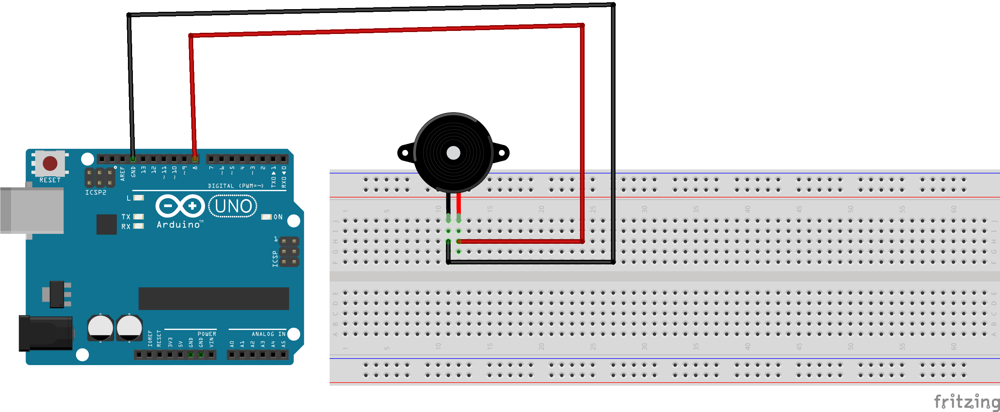
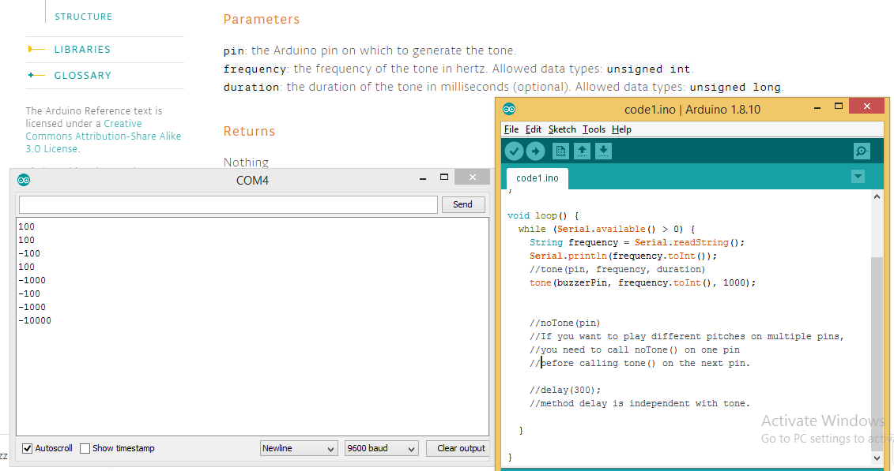
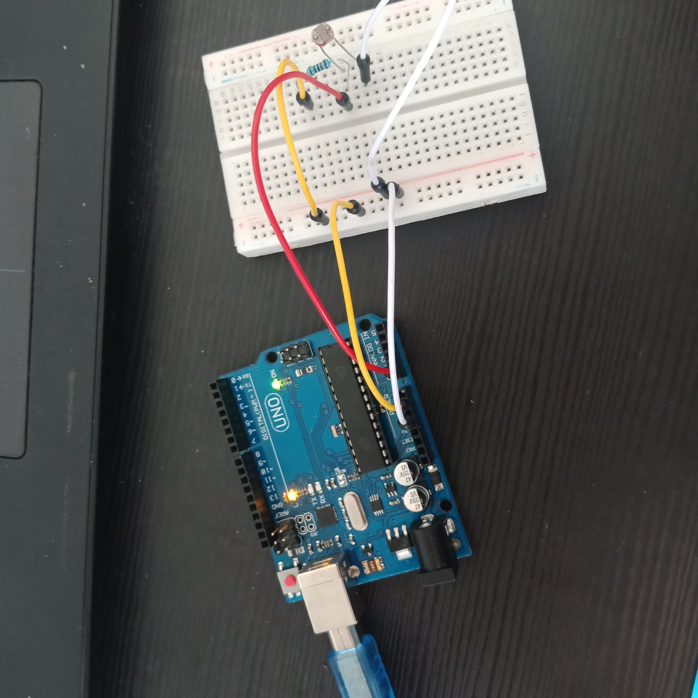
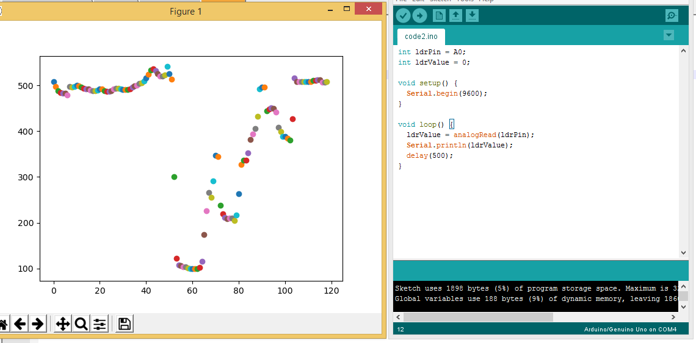
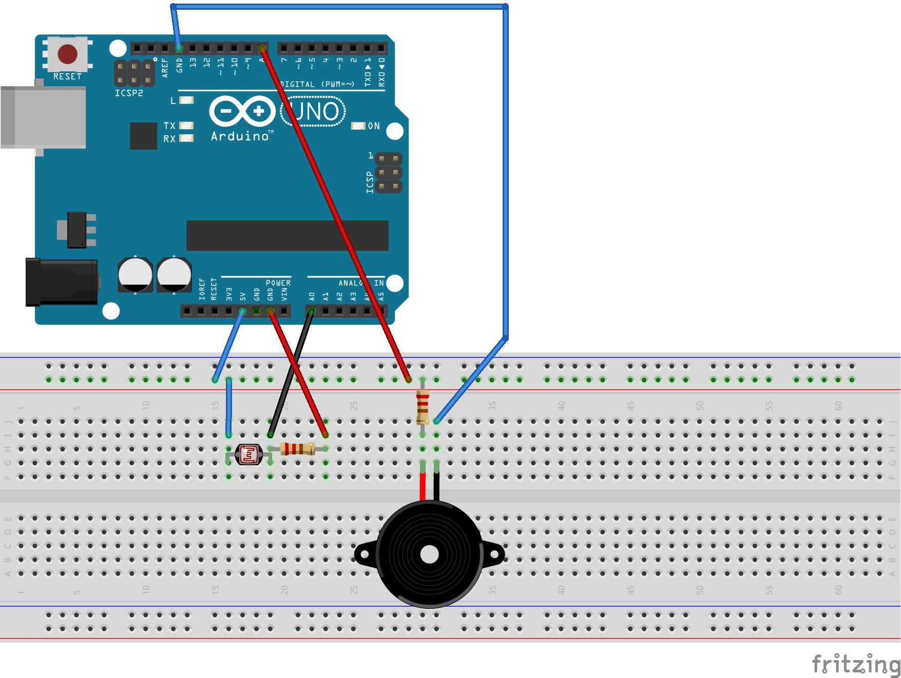

# Practice 2: Serial

## Passive Buzzer

We create a sketch which include PassiveBuzzer and Arduino UNO


We use Serial to send frequency's value to Arduino UNO. Then we tone buzzer with this frequency.

```C
int buzzerPin = 8;
void setup() {
  //baudrate = 9600
  Serial.begin(9600);
  pinMode(buzzerPin, OUTPUT);
}

void loop() {
  while (Serial.available() > 0) {
    String frequency = Serial.readString();
    Serial.println(frequency.toInt());
    //tone(pin, frequency, duration)
    tone(buzzerPin, frequency.toInt(), 1000);


    //noTone(pin)
    //If you want to play different pitches on multiple pins, 
    //you need to call noTone() on one pin 
    //before calling tone() on the next pin.

    //delay(300);
    //method delay is independent with tone.
    
  }

}
```

Values we sent


## LDR

We connect the LDR to Arduino UNO (Port 5v - LDR and Port GND - Resistor - Port A0)


We use this code to send LDR's value to Computer(Port COM4)
```C
int ldrPin = A0;
int ldrValue = 0;

void setup() {
  Serial.begin(9600);
}

void loop() {
  ldrValue = analogRead(ldrPin);
  Serial.println(ldrValue);
  delay(500);
}
```

We use this python code to read LDR's value in Computer (Port COM4)

```python
from serial import Serial
import matplotlib.pyplot as plt

plt.ion()
i=0

ser = Serial('COM4',9600)
ser.close()
ser.open()
data = ser.readline()
splt=data.split()

if(len(splt)==1):
	fig,ax=plt.subplots()
	axs=[ax]
else:
	fig, axs = plt.subplots(len(splt), sharex=True)
	
while True:

	data = ser.readline()
	splt=data.split();
	for p in range(len(splt)):
		print(splt[p].decode(), end = ' ')
		axs[p].scatter(i, float(splt[p].decode()))
		#axs[p].yaxis.set_major_locator(plt.MaxNLocator(4))
		
	print()
	i += 1
	plt.show()
	plt.pause(0.0001)  # Note this correction
```

This is result:


## Sketch contains both Buzzer and LDR.



